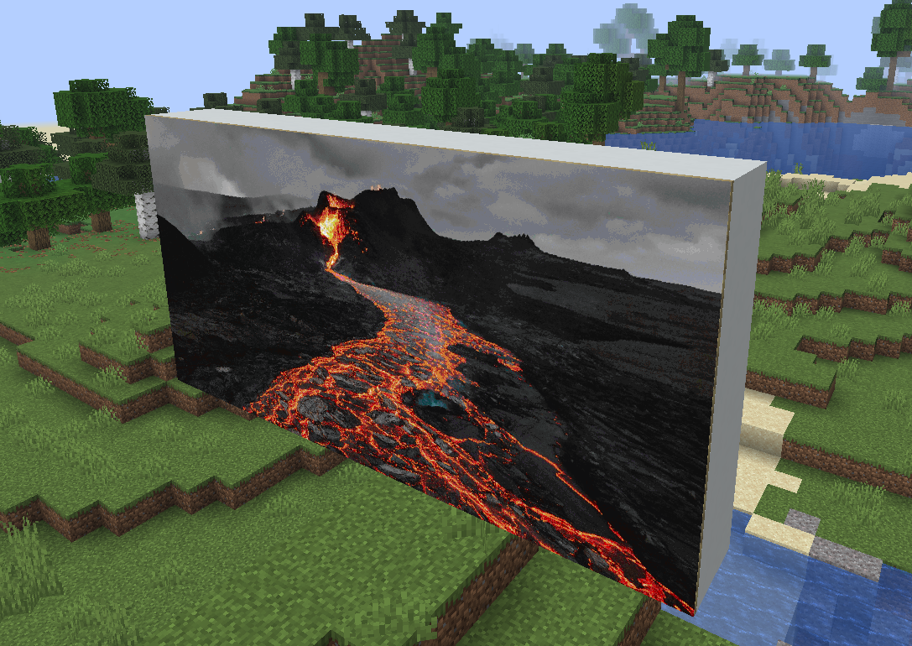

# Mapify

Mapify is a plugin that is used to convert your images into Minecraft maps that can be put in item frames or held in hand.

> For support, join my Discord: <https://discord.gg/qsUP2t5VpW>

> Photo is ["brown and black mountain under white clouds"](https://unsplash.com/photos/brown-and-black-mountain-under-white-clouds-80x3QULJDN4) by Tetiana Grypachevska

## Commands

There are two commands: `/mapify` and `/refreshmaps`.

### `/mapify`

**Usage:** `/mapify <url> [dimensions]`

This will take a url and convert it into a set of maps, depending on the dimensions.

Dimensions are provided using the format `WIDTHxHEIGHT` (in terms of blocks).

Your images will be stretched to fit into the desired size.

### `/mapify reload`

Reload config file

### `/refreshmaps [radius]`

Refresh the maps in your inventory or in item frames within a given
radius.

## Config

- Configurable whitelist using raw strings or regular expressions.
- Configurable cache duration
- Https only toggle

## Permissions

- `mapify.command.mapify` - Permission to use the `/mapify` command - Default: OP
- `mapify.command.mapify.reload` - Permission to use the `/mapify reload` command - Default: OP
- `mapify.command.refreshmaps` - Permission to use the `/refreshmaps` command - Default: OP
- `mapify.operator` - Permission to determine whether mapify should treat a player as an operator - Default: OP

## FAQ

### Error message of "This is not a valid domain..."

You need to edit the config and add the domain that you wish to the
`whitelist` field.  You can add a domain, like `i.imgur.com` or a
regular expression like `REGEXP:.*\.google\.com` to match all domains
that end with `google.com`

This is to help with security on your server as having untrusted domains
can allow users to download malicious software on your server.  If you
don't want this protection, you can add `"REGEXP:.*"` to the `whitelist`
in the config to disable the filtering.

### Error message of "An internal error occurred while attempting to perform this command"

When this message occurs in chat, there's a large error message that will
print to the console (usually red or yellow, if the console supports
colour).  Please join my Discord, tell me what command you ran, and send
the error message.
